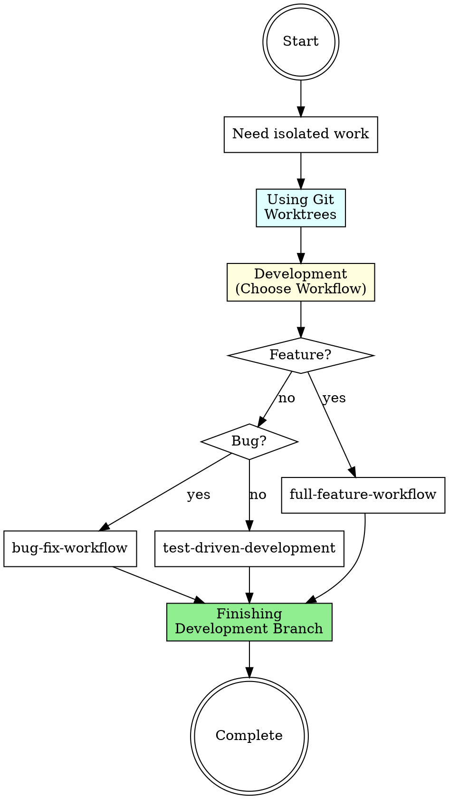

# Branch Lifecycle Workflow

## Overview

**Complete branch lifecycle orchestration** from creation to integration. Sequences using-git-worktrees (isolation) → development (your choice of workflows) → finishing-a-development-branch (cleanup).

**Core principle:** Isolated development in worktrees prevents context switching pollution and keeps work organized from start to finish.

## When to Use

**Triggers:**

- Starting new feature that needs isolation
- About to execute an implementation plan
- Switching to different work context
- Want to keep main branch clean while developing
- Experimenting with major changes

**Do NOT use for:**

- Quick fixes on current branch
- Single-file changes
- Continuing work on existing branch
- Emergency hotfixes (may need faster path)

## The Three Stages

### Stage 1: Using Git Worktrees (Isolation Setup)

**Purpose:** Create isolated working directory for the new feature/fix.

**Invocation:**

```
Skill(superpowers:using-git-worktrees)
```

**What happens:**

- Choose smart directory name
- Create worktree from main/appropriate base branch
- Set up new branch for the work
- Verify worktree is clean and ready
- Navigate to worktree directory

**Output:** Isolated worktree with fresh branch, ready for development

**Handoff to Stage 2:** Begin development in the isolated worktree.

---

### Stage 2: Development (Your Workflow Choice)

**Purpose:** Implement the feature/fix using appropriate development workflow.

**Choose based on task type:**

#### For New Features:

```
Skill(full-feature-workflow)
```

Orchestrates: brainstorming → feature-dev → TDD → subagent-driven-development

#### For Bug Fixes:

```
Skill(bug-fix-workflow)
```

Orchestrates: systematic-debugging → TDD → verification-before-completion

#### For Simple Changes:

Just use TDD directly:

```
Skill(superpowers:test-driven-development)
```

**Output:** Completed implementation with passing tests

**Handoff to Stage 3:** When work is complete and verified, clean up.

---

### Stage 3: Finishing Development Branch (Integration & Cleanup)

**Purpose:** Integrate work and clean up worktree.

**Invocation:**

```
Skill(superpowers:finishing-a-development-branch)
```

**What happens:**

- Present integration options (merge, PR, archive)
- Execute chosen integration path
- Remove worktree directory
- Clean up branch references if needed
- Return to main worktree

**Output:** Work integrated, worktree cleaned up, branch lifecycle complete

---

## Workflow Diagram



## Stage Transitions

| From           | To          | Required Artifacts                           | Red Flag if Missing                     |
| -------------- | ----------- | -------------------------------------------- | --------------------------------------- |
| Worktree Setup | Development | Clean worktree, new branch created           | Developing without isolated environment |
| Development    | Finishing   | Tests passing, implementation complete       | Finishing without verifying work        |
| Finishing      | Complete    | Worktree removed, branch integrated/archived | Leaving worktrees cluttered             |

## Red Flags - Worktree Discipline Issues

**STOP if you find yourself:**

- ❌ Starting development in main worktree for complex features
- ❌ Leaving multiple abandoned worktrees
- ❌ Merging without cleanup
- ❌ Reusing worktree for different features
- ❌ Forgetting which worktree you're in
- ❌ Skipping isolation for "just one more change"

**All of these mean:** Use proper branch lifecycle discipline.

## Development Workflow Selection Guide

| Task Type        | Workflow to Use           | Why                                                    |
| ---------------- | ------------------------- | ------------------------------------------------------ |
| New feature      | `full-feature-workflow`   | Needs brainstorming, planning, TDD, parallel execution |
| Bug fix          | `bug-fix-workflow`        | Needs systematic debugging, TDD, verification          |
| Simple refactor  | `test-driven-development` | Just needs TDD cycle                                   |
| Experiment/spike | `test-driven-development` | Keep it simple, may not merge                          |

## Common Mistakes

### Mistake 1: "Worktrees are overkill for this feature"

**Reality:** Context switching without worktrees means uncommitted changes, stashing, mental overhead.

**Fix:** Use Stage 1 (worktrees) for ALL non-trivial work. It's fast and keeps you organized.

### Mistake 2: "I'll clean up the worktree later"

**Reality:** Forgotten worktrees accumulate, waste disk space, cause confusion.

**Fix:** Always complete Stage 3 (finishing) immediately after integration.

### Mistake 3: "I'll just merge from the worktree directly"

**Reality:** Missing the finishing-a-development-branch skill means skipping important cleanup and verification steps.

**Fix:** Use Stage 3 skill for systematic completion.

### Mistake 4: "I started in main worktree, I'll just finish here"

**Reality:** Now you have uncommitted work blocking other tasks. Should have isolated from the start.

**Fix:** Start over with Stage 1 if work is complex enough to need isolation.

## Quick Reference

| Stage      | Skill Invocation                                    | Output                     | When          |
| ---------- | --------------------------------------------------- | -------------------------- | ------------- |
| 1. Setup   | `Skill(superpowers:using-git-worktrees)`            | Isolated worktree + branch | Start of work |
| 2. Develop | Choose workflow (see table above)                   | Completed implementation   | During work   |
| 3. Finish  | `Skill(superpowers:finishing-a-development-branch)` | Integrated + cleaned up    | End of work   |

## Worktree Benefits

**Why use worktrees instead of branch switching:**

| Without Worktrees                 | With Worktrees                     |
| --------------------------------- | ---------------------------------- |
| Stash changes before switching    | Work in parallel directories       |
| Rebuild dependencies after switch | Each worktree has own dependencies |
| Context pollution                 | Clean isolation                    |
| Single task at a time             | Multiple tasks possible            |
| Mental overhead                   | Clear directory = clear context    |

## Real-World Impact

**With branch lifecycle workflow:**

- Worktrees → clean isolation, no context switching overhead
- Systematic development → quality work
- Systematic finishing → clean repo state
- Discipline → no abandoned branches/worktrees

**Without it:**

- No isolation → stash hell, context confusion
- Skip workflows → lower quality
- Skip cleanup → cluttered repository
- Ad-hoc process → wasted mental energy
