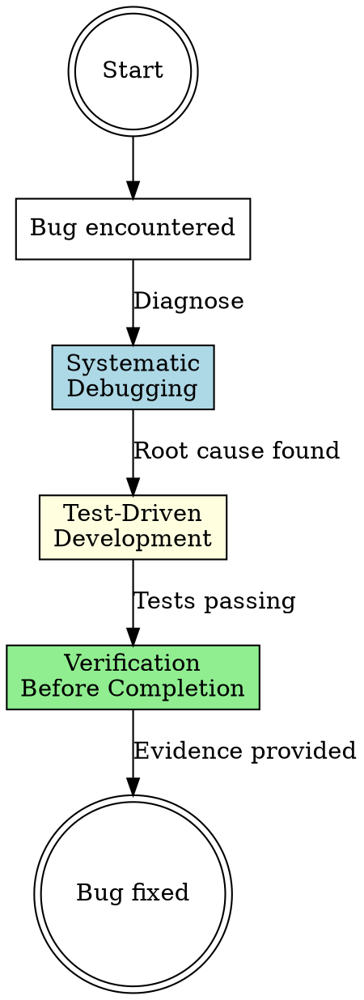

# Bug Fix Workflow

## Overview

**Systematic bug fixing orchestration** that prevents "fix without understanding" mistakes. Sequences three critical skills: systematic-debugging (root cause), test-driven-development (reproduce + fix), and verification-before-completion (proof it works).

**Core principle:** Never claim a bug is fixed without evidence. Guessing at fixes wastes time and creates regression risk.

## When to Use

**Triggers:**

- Test failures (unit, integration, E2E)
- Unexpected behavior or errors
- User-reported bugs
- Regression after changes
- "This should work but doesn't" moments

**Do NOT use for:**

- Feature requests (use full-feature-workflow)
- Planned refactoring (use TDD directly)
- Documentation fixes
- Known issues with clear fixes

## The Three Phases

### Phase 1: Systematic Debugging (Root Cause Analysis)

**Purpose:** Understand WHY the bug exists before attempting to fix.

**Invocation:**

```
Skill(superpowers:systematic-debugging)
```

**What happens:**

- Reproduce the bug reliably
- Trace execution to pinpoint failure point
- Identify root cause (not just symptoms)
- Understand why the code behaved this way
- Document hypothesis for the fix

**Output:** Root cause diagnosis + reproduction steps

**Handoff to Phase 2:** Once you understand WHY it broke, write tests to prevent regression.

---

### Phase 2: Test-Driven Development (Reproduce + Fix)

**Purpose:** Create failing test for the bug, then fix it.

**Invocation:**

```
Skill(superpowers:test-driven-development)
```

**What happens:**

- Write test that reproduces the bug (should fail - RED)
- Verify test fails for the RIGHT reason
- Implement minimal fix to make test pass (GREEN)
- Refactor if needed while keeping tests green (REFACTOR)
- Ensure fix doesn't break existing tests

**Output:** Passing test(s) + bug fix implementation

**Handoff to Phase 3:** Before claiming the bug is fixed, verify comprehensively.

---

### Phase 3: Verification Before Completion (Proof It Works)

**Purpose:** Run all relevant tests and builds to confirm the fix works without breaking anything.

**Invocation:**

```
Skill(superpowers:verification-before-completion)
```

**What happens:**

- Run full test suite (unit, integration, E2E as appropriate)
- Run build/typecheck to catch type errors
- Verify the original reproduction steps now pass
- Check for unintended side effects
- Document evidence before claiming completion

**Output:** Evidence that bug is fixed + no regressions

---

## Workflow Diagram



## Phase Transitions

| From         | To           | Required Artifacts                       | Red Flag if Missing                             |
| ------------ | ------------ | ---------------------------------------- | ----------------------------------------------- |
| Debugging    | TDD          | Root cause diagnosis, reproduction steps | Writing test without understanding why it broke |
| TDD          | Verification | Passing test for bug, fix implemented    | Claiming fix without running tests              |
| Verification | Complete     | Test suite passing, build succeeding     | Saying "fixed" without evidence                 |

## Red Flags - You're Skipping Steps

**STOP if you find yourself:**

- ❌ Writing a fix before understanding root cause
- ❌ Claiming "I think this fixes it" without tests
- ❌ Skipping test because "bug is obvious"
- ❌ Not running full test suite after fix
- ❌ Saying "fixed" without evidence
- ❌ Jumping directly from bug report to code change

**All of these mean:** Back up to Phase 1 (systematic debugging).

## Common Mistakes

### Mistake 1: "I can see the bug, I'll just fix it"

**Reality:** "Obvious" bugs often have non-obvious root causes. Quick fixes miss the real problem.

**Fix:** Always run Phase 1 (systematic debugging) to understand WHY it broke.

### Mistake 2: "Tests would be overkill for this simple bug"

**Reality:** Bugs without tests regress. You'll fix it again in 3 months.

**Fix:** Write the test (Phase 2). Takes 2 minutes, prevents future rework.

### Mistake 3: "The test passes, so it's fixed"

**Reality:** One test passing doesn't mean you didn't break something else.

**Fix:** Run Phase 3 (verification) - full test suite + build.

### Mistake 4: "I tested it manually, it works"

**Reality:** Manual testing proves nothing when tests fail later. Need reproducible evidence.

**Fix:** Use verification-before-completion to run actual test commands.

## Quick Reference

| Phase     | Skill Invocation                                    | Output               | Must Complete Before Next |
| --------- | --------------------------------------------------- | -------------------- | ------------------------- |
| 1. Debug  | `Skill(superpowers:systematic-debugging)`           | Root cause diagnosis | Writing fix code          |
| 2. TDD    | `Skill(superpowers:test-driven-development)`        | Passing test + fix   | Claiming completion       |
| 3. Verify | `Skill(superpowers:verification-before-completion)` | Test suite passing   | Committing/merging        |

## Real-World Impact

**With bug fix workflow:**

- Root cause analysis → fix the actual problem, not symptoms
- Tests for bugs → prevent regression
- Verification → catch side effects before merge
- Evidence → confidence in "fixed" claims

**Without it:**

- Skip debugging → fix symptoms, bug returns
- Skip tests → same bug in 3 months
- Skip verification → break other features
- Skip evidence → "works on my machine" syndrome
