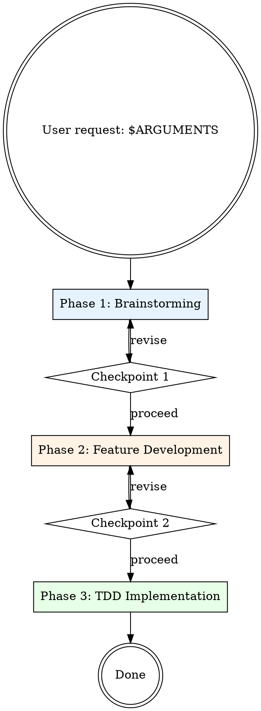

# End-to-End Implementation

## Overview

**Three skills. One workflow. Maximum rigor.**

This skill orchestrates a complete implementation workflow:

1. **Brainstorm** — Explore intent, requirements, and design (superpowers:brainstorming)
2. **Feature Development** — Guided exploration, architecture, implementation (feature-dev:feature-dev)
3. **TDD** — Test-driven development for all new code (test-driven-development:test-driven-development)

User checkpoints between each phase ensure alignment before proceeding.

## When to Use

Use e2e-implementation for:

- New features requiring full exploration and rigor
- Complex changes where skipping steps leads to rework
- Any implementation where you want the "full process"

**Not for:** Quick fixes, typos, or well-scoped changes where simpler workflows suffice.

## The Workflow



## Phase 1: Brainstorming

**Goal:** Understand intent, explore requirements, produce design spec.

**Action:** Invoke `Skill(superpowers:brainstorming)` with $ARGUMENTS

The brainstorming skill will:

- Ask questions one at a time to refine the idea
- Propose 2-3 approaches with trade-offs
- Present design in sections (200-300 words each)
- Write validated design to `docs/plans/`

**Checkpoint 1:** After brainstorming completes, ask user:

> "Brainstorming complete. Design documented. Ready to proceed to feature development?"

## Phase 2: Feature Development

**Goal:** Deep codebase exploration, architecture design, and implementation planning.

**Action:** Invoke `Skill(feature-dev:feature-dev)` with the brainstorming output context

The feature-dev skill will:

- **Discovery** — Clarify what needs to be built
- **Exploration** — Launch code-explorer agents to understand patterns
- **Clarifying Questions** — Fill gaps before designing
- **Architecture** — Launch code-architect agents for approaches
- **Implementation** — Build the feature following chosen architecture
- **Quality Review** — Launch code-reviewer agents

**Checkpoint 2:** After feature-dev implementation completes, ask user:

> "Feature implementation complete. Ready to proceed to TDD verification and refinement?"

## Phase 3: TDD Verification

**Goal:** Ensure all new code follows test-driven development principles.

**Action:** Invoke `Skill(test-driven-development:test-driven-development)`

The TDD skill enforces:

- **RED** — Write failing test first
- **GREEN** — Minimal code to pass
- **REFACTOR** — Clean up while staying green

At this phase, review implemented code and add missing tests following strict TDD:

1. Identify any untested behavior
2. Write failing tests for each
3. If code exists without test-first proof, consider rewriting with TDD

## Execution Checklist

Before proceeding, verify each phase completes fully:

```
Phase 1: Brainstorming
□ Invoked Skill(superpowers:brainstorming)
□ Design explored and documented
□ User approved design at Checkpoint 1

Phase 2: Feature Development
□ Invoked Skill(feature-dev:feature-dev)
□ Codebase explored with agents
□ Architecture chosen with user input
□ Implementation complete
□ Code reviewed
□ User approved at Checkpoint 2

Phase 3: TDD
□ Invoked Skill(test-driven-development:test-driven-development)
□ All new code verified for test coverage
□ Missing tests added (test-first)
□ All tests passing
```

## Common Mistakes

| Mistake                                        | Reality                       | Fix                      |
| ---------------------------------------------- | ----------------------------- | ------------------------ |
| "Skip to implementation, I know what to build" | Assumptions kill projects     | Start at Phase 1, always |
| "Tests can come after"                         | TDD means test-FIRST          | Phase 3 is mandatory     |
| "Phases feel redundant"                        | Each phase has distinct value | Trust the process        |
| "Checkpoints slow things down"                 | Checkpoints prevent rework    | Pause, align, proceed    |

## The Iron Law

```
NO SKIPPING PHASES. NO SKIPPING CHECKPOINTS.
```

The value is in the complete workflow. Partial compliance defeats the purpose.

If you find yourself rationalizing a shortcut, that's exactly when you need the full process.
