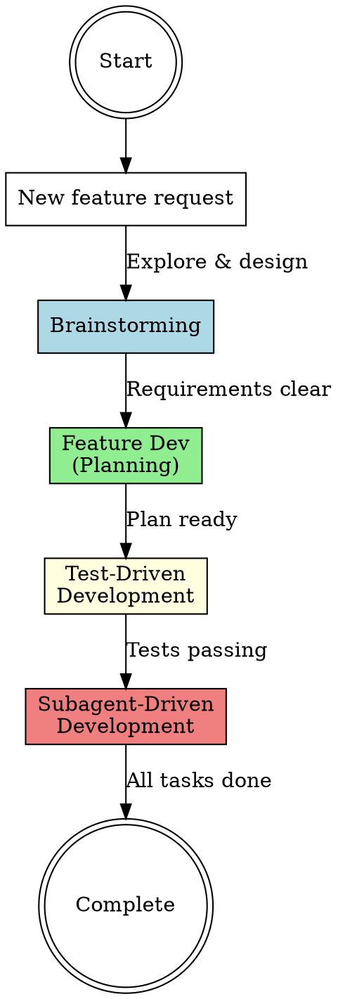

# Full Feature Workflow

## Overview

**Complete feature development orchestration** that sequences four critical skills: brainstorming (design), feature-dev (planning), test-driven-development (quality), and subagent-driven-development (execution).

**Core principle:** Each phase builds on the previous. Skipping phases creates technical debt, misaligned implementations, and brittle code.

## When to Use

**Triggers:**

- User requests a new feature or significant functionality
- About to write code for any non-trivial change
- Multi-file changes expected
- Architectural decisions needed
- Requirements unclear or underspecified

**Do NOT use for:**

- Single-line fixes or typos
- Documentation-only changes
- Simple refactors with clear scope
- Pure research/exploration tasks

## The Four Phases

### Phase 1: Brainstorming (Design Exploration)

**Purpose:** Understand user intent, explore requirements, discuss trade-offs BEFORE committing to an approach.

**Invocation:**

```
Skill(superpowers:brainstorming)
```

**What happens:**

- Explore user's goals and constraints
- Discuss multiple possible approaches
- Identify edge cases and non-functional requirements
- Align on scope and success criteria
- Document decisions

**Output:** Design decisions and requirements clarification

**Handoff to Phase 2:** Once you have clear requirements and chosen approach, move to planning.

---

### Phase 2: Feature Development (Architecture & Planning)

**Purpose:** Understand existing codebase patterns, design implementation architecture, create detailed plan.

**Invocation:**

```
Skill(feature-dev:feature-dev)
```

**What happens:**

- Explore codebase to understand existing patterns
- Identify files that need creation/modification
- Design component structure and data flows
- Create step-by-step implementation blueprint
- Document dependencies and critical paths

**Output:** Implementation plan with specific files, components, and build sequence

**Handoff to Phase 3:** With implementation plan ready, establish testing strategy before coding.

---

### Phase 3: Test-Driven Development (Quality Foundation)

**Purpose:** Define expected behavior through tests BEFORE writing implementation code.

**Invocation:**

```
Skill(superpowers:test-driven-development)
```

**What happens:**

- Write failing tests for each planned component
- Verify tests fail for the right reasons (RED)
- Write minimal implementation to pass tests (GREEN)
- Refactor while keeping tests green (REFACTOR)
- Ensure test coverage for edge cases

**Output:** Passing tests that define expected behavior + implementation code

**Handoff to Phase 4:** With tests passing and implementation complete, execute remaining tasks systematically.

---

### Phase 4: Subagent-Driven Development (Parallel Execution)

**Purpose:** Execute independent implementation tasks efficiently using parallel subagents.

**Invocation:**

```
Skill(superpowers:subagent-driven-development)
```

**What happens:**

- Identify independent tasks from plan
- Dispatch subagents in parallel for non-dependent work
- Each subagent handles one isolated task
- Coordinate results and integrate changes
- Review code quality systematically

**Output:** Fully implemented feature with all tasks completed

---

## Workflow Diagram



## Phase Transitions (Critical Handoffs)

| From          | To           | Required Artifacts                                     | Red Flag if Missing                               |
| ------------- | ------------ | ------------------------------------------------------ | ------------------------------------------------- |
| Brainstorming | Feature Dev  | Design decisions, requirements doc, chosen approach    | Starting to plan without clear requirements       |
| Feature Dev   | TDD          | Implementation plan, file list, architecture blueprint | Writing tests without understanding what to build |
| TDD           | Subagent Dev | Passing tests, core implementation complete            | Dispatching subagents before tests pass           |
| Subagent Dev  | Complete     | All independent tasks finished, integration tested     | Claiming done with incomplete tasks               |

## Red Flags - You're Skipping Phases

**STOP if you find yourself:**

- ❌ Writing implementation code before brainstorming requirements
- ❌ Creating a plan without exploring the codebase (feature-dev)
- ❌ Writing implementation before writing tests (TDD violation)
- ❌ Dispatching subagents before core logic has passing tests
- ❌ Saying "this is simple, we can skip [phase]"
- ❌ Jumping directly to code from user request

**All of these mean:** Back up to the appropriate phase. Don't skip.

## Common Mistakes

### Mistake 1: "Requirements are obvious"

**Reality:** What seems obvious often has hidden edge cases. Brainstorming surfaces these.

**Fix:** Always run Phase 1, even for "simple" features. Takes 5 minutes, saves hours.

### Mistake 2: "I'll write tests after implementation"

**Reality:** Tests-after verify "what did I write?" not "what should I write?" Missing the point of TDD.

**Fix:** RED-GREEN-REFACTOR. Tests first. Always.

### Mistake 3: "Planning slows me down"

**Reality:** Coding without a plan means rewriting when you discover architectural issues.

**Fix:** Use feature-dev (Phase 2) to understand patterns before coding.

### Mistake 4: "I can parallelize sooner"

**Reality:** Dispatching subagents before core logic is solid causes integration hell.

**Fix:** Complete Phase 3 (TDD for core logic) before Phase 4 (parallel execution).

## Quick Reference

| Phase            | Skill Invocation                                 | Output                          | Duration  |
| ---------------- | ------------------------------------------------ | ------------------------------- | --------- |
| 1. Brainstorming | `Skill(superpowers:brainstorming)`               | Requirements & design decisions | 5-15 min  |
| 2. Feature Dev   | `Skill(feature-dev:feature-dev)`                 | Implementation plan             | 10-20 min |
| 3. TDD           | `Skill(superpowers:test-driven-development)`     | Passing tests + implementation  | Variable  |
| 4. Subagent Dev  | `Skill(superpowers:subagent-driven-development)` | Completed feature               | Variable  |

## Real-World Impact

**With full workflow:**

- Requirements clarified upfront → fewer mid-implementation rewrites
- Architecture planned → cleaner code structure
- Tests first → higher quality, fewer bugs
- Parallel execution → faster delivery

**Without it:**

- Skip brainstorming → build wrong thing
- Skip planning → spaghetti code
- Skip TDD → brittle implementation
- Skip orchestration → sequential slowness
