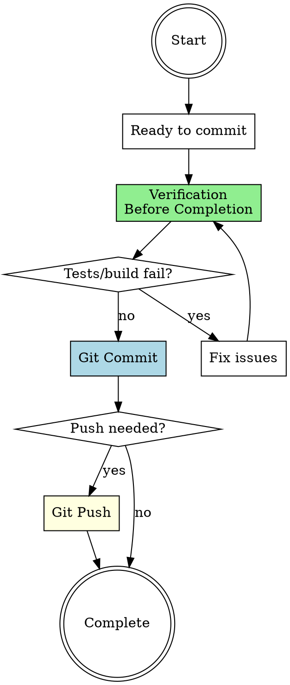

# Quick Commit Workflow

## Overview

**Quality-gated commit orchestration** that prevents committing broken code. Sequences verification-before-completion (proof) → git-workflow:commit (create commit) → optional push.

**Core principle:** Never commit code that doesn't pass tests and build. Broken commits pollute history and break teammates.

## When to Use

**Triggers:**

- Ready to commit work
- User says "commit this"
- Finished a logical unit of work
- About to switch contexts
- End of work session

**Do NOT use for:**

- Emergency hotfixes with explicit override
- WIP commits in local-only branches (if agreed upon)
- Amending previous commits (different workflow)

## The Two/Three Phases

### Phase 1: Verification Before Completion (Quality Gate)

**Purpose:** Prove the code works before committing.

**Invocation:**

```
Skill(superpowers:verification-before-completion)
```

**What happens:**

- Run relevant test suite (unit, integration, E2E as appropriate)
- Run build and typecheck
- Verify no linting errors
- Check for formatting issues (if formatter configured)
- Document passing test output

**Output:** Evidence that tests pass and build succeeds

**Handoff to Phase 2:** Only proceed to commit if verification passes.

---

### Phase 2: Git Workflow Commit (Create Commit)

**Purpose:** Create a well-formed git commit with conventional message.

**Invocation:**

```
Skill(git-workflow:commit)
```

**What happens:**

- Stage relevant changed files
- Review git diff to verify changes
- Write conventional commit message
- Create the commit
- Verify commit success with git status

**Output:** Clean git commit in history

**Handoff to Phase 3 (Optional):** If pushing to remote is needed.

---

### Phase 3 (Optional): Git Workflow Push

**Purpose:** Push commits to remote repository.

**Invocation:**

```
Skill(git-workflow:push)
```

**What happens:**

- Push current branch to remote
- Handle remote tracking setup if needed
- Verify push success

**Output:** Commits available on remote

---

## Workflow Diagram



## Phase Transitions

| From         | To              | Required Artifacts              | Red Flag if Missing              |
| ------------ | --------------- | ------------------------------- | -------------------------------- |
| Verification | Commit          | Tests passing, build succeeding | Committing without running tests |
| Commit       | Push (optional) | Clean commit created            | Pushing without verifying commit |

## Red Flags - You're Skipping Verification

**STOP if you find yourself:**

- ❌ Committing without running tests
- ❌ Saying "I'll fix the tests in the next commit"
- ❌ Using `--no-verify` to skip hooks
- ❌ Committing with known test failures
- ❌ Skipping typecheck because "it's probably fine"
- ❌ Ignoring build errors

**All of these mean:** Run Phase 1 (verification) before committing.

## Common Mistakes

### Mistake 1: "Tests take too long, I'll run them later"

**Reality:** Later never comes. You forget, push broken code, break CI.

**Fix:** Run verification BEFORE commit. Non-negotiable.

### Mistake 2: "It's just a small change, doesn't need tests"

**Reality:** Small changes break things. One-line bugs are common.

**Fix:** Size of change doesn't matter. Run verification.

### Mistake 3: "Pre-commit hook will catch it"

**Reality:** Hooks are safety nets, not substitutes for discipline. Plus you might `--no-verify`.

**Fix:** Verify manually BEFORE triggering hooks.

### Mistake 4: "I'm the only one on this branch"

**Reality:** You'll merge to main eventually. Broken commits waste future debugging time.

**Fix:** Treat every commit as permanent. Verify before committing.

## Quick Reference

| Phase     | Skill Invocation                                    | Output                     | Required?   |
| --------- | --------------------------------------------------- | -------------------------- | ----------- |
| 1. Verify | `Skill(superpowers:verification-before-completion)` | Tests pass, build succeeds | ✅ Always   |
| 2. Commit | `Skill(git-workflow:commit)`                        | Git commit created         | ✅ Always   |
| 3. Push   | `Skill(git-workflow:push)`                          | Commits on remote          | ⚠️ Optional |

## Real-World Impact

**With quick commit workflow:**

- Verification → no broken commits in history
- Quality gates → teammates can trust main branch
- Discipline → CI stays green
- Evidence → confidence when pushing

**Without it:**

- Skip verification → broken commits
- Break CI → block teammates
- Manual cleanup → wasted time on revert/fix commits
- Stress → "did I break anything?" anxiety
