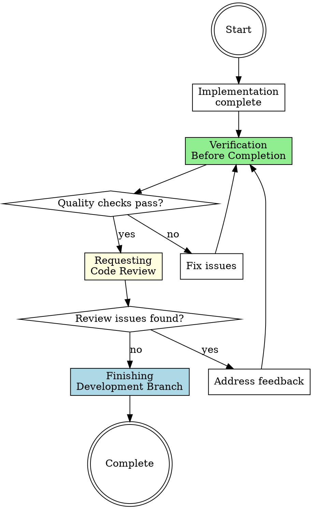

# Ready to Merge Workflow

## Overview

**Integration readiness orchestration** that ensures quality before merging or creating PRs. Sequences verification-before-completion (proof) → requesting-code-review (quality check) → finishing-a-development-branch (integration).

**Core principle:** Work isn't "done" until it's verified, reviewed, and integrated. Skipping steps creates tech debt and bugs.

## When to Use

**Triggers:**

- Implementation complete, tests passing
- User says "this is done" or "ready to merge"
- About to create a pull request
- Finished all tasks in the plan
- Ready to integrate feature branch

**Do NOT use for:**

- Work in progress (WIP)
- Exploratory branches not meant for merge
- Emergency hotfixes (may need different process)

## The Three Phases

### Phase 1: Verification Before Completion (Final Quality Check)

**Purpose:** Prove everything works before requesting review.

**Invocation:**

```
Skill(superpowers:verification-before-completion)
```

**What happens:**

- Run full test suite (unit + integration + E2E)
- Run build and typecheck
- Check linting and formatting
- Verify all plan tasks are complete
- Document passing output as evidence

**Output:** Evidence that all quality checks pass

**Handoff to Phase 2:** Only request review if verification passes.

---

### Phase 2: Requesting Code Review (Quality Validation)

**Purpose:** Review implementation against requirements and coding standards.

**Invocation:**

```
Skill(superpowers:requesting-code-review)
```

**What happens:**

- Review code against original plan/spec
- Check adherence to architectural patterns
- Verify test coverage is adequate
- Identify potential issues or improvements
- Create checklist of findings

**Output:** Code review report with any issues identified

**Handoff to Phase 3:** After addressing review feedback, proceed to integration.

---

### Phase 3: Finishing Development Branch (Integration)

**Purpose:** Complete the development work by choosing appropriate integration path.

**Invocation:**

```
Skill(superpowers:finishing-a-development-branch)
```

**What happens:**

- Present structured options:
  - Merge directly to main (if appropriate)
  - Create pull request for team review
  - Clean up worktree (if using git worktrees)
  - Archive branch (if experiment/spike)
- Execute chosen integration path
- Update documentation if needed

**Output:** Work integrated and branch lifecycle complete

---

## Workflow Diagram



## Phase Transitions

| From         | To        | Required Artifacts                       | Red Flag if Missing                        |
| ------------ | --------- | ---------------------------------------- | ------------------------------------------ |
| Verification | Review    | All tests passing, build succeeding      | Requesting review with failing tests       |
| Review       | Finishing | Code review complete, feedback addressed | Merging without addressing review findings |
| Finishing    | Complete  | Integration path executed                | Incomplete branch cleanup                  |

## Red Flags - You're Rushing Integration

**STOP if you find yourself:**

- ❌ Creating PR without running tests
- ❌ Merging without code review (even self-review)
- ❌ Skipping verification because "I ran tests earlier"
- ❌ Ignoring review feedback
- ❌ Leaving worktree/branches without cleanup
- ❌ Saying "done" with known issues

**All of these mean:** Back up and run the appropriate phase.

## Common Mistakes

### Mistake 1: "Tests passed yesterday, I'll just merge"

**Reality:** Code changed since yesterday. Tests need fresh run.

**Fix:** Always run Phase 1 (verification) immediately before integration.

### Mistake 2: "I wrote the code, I don't need to review it"

**Reality:** Self-review catches issues. Fresh eyes (even your own) find bugs.

**Fix:** Run Phase 2 (code review) systematically. Use the skill's checklist.

### Mistake 3: "I'll merge now, clean up the branch later"

**Reality:** Later never comes. Stale branches accumulate.

**Fix:** Complete Phase 3 (finishing) including cleanup.

### Mistake 4: "The review found issues but they're not critical"

**Reality:** Non-critical issues accumulate into tech debt.

**Fix:** Address feedback before integrating. If truly non-critical, document why skipping.

## Quick Reference

| Phase     | Skill Invocation                                    | Output                     | Blocks Integration? |
| --------- | --------------------------------------------------- | -------------------------- | ------------------- |
| 1. Verify | `Skill(superpowers:verification-before-completion)` | Tests pass, build succeeds | ✅ Yes              |
| 2. Review | `Skill(superpowers:requesting-code-review)`         | Code review report         | ✅ Yes (if issues)  |
| 3. Finish | `Skill(superpowers:finishing-a-development-branch)` | Integration complete       | N/A                 |

## Integration Path Options (Phase 3)

The finishing-a-development-branch skill presents these options:

| Option                | When to Use                                        | Result                        |
| --------------------- | -------------------------------------------------- | ----------------------------- |
| **Merge to main**     | Solo dev, small repo, simple changes               | Direct merge                  |
| **Create PR**         | Team environment, complex changes, need discussion | PR for review                 |
| **Clean up worktree** | Used git worktrees for isolation                   | Worktree removed              |
| **Archive branch**    | Spike/experiment not for merge                     | Branch documented, not merged |

## Real-World Impact

**With ready-to-merge workflow:**

- Verification → confidence in code quality
- Code review → catch issues before merge
- Systematic finishing → clean repo state
- Discipline → main branch stays stable

**Without it:**

- Skip verification → break main branch
- Skip review → ship bugs
- Skip cleanup → cluttered branches
- Rushed merges → tech debt accumulation
